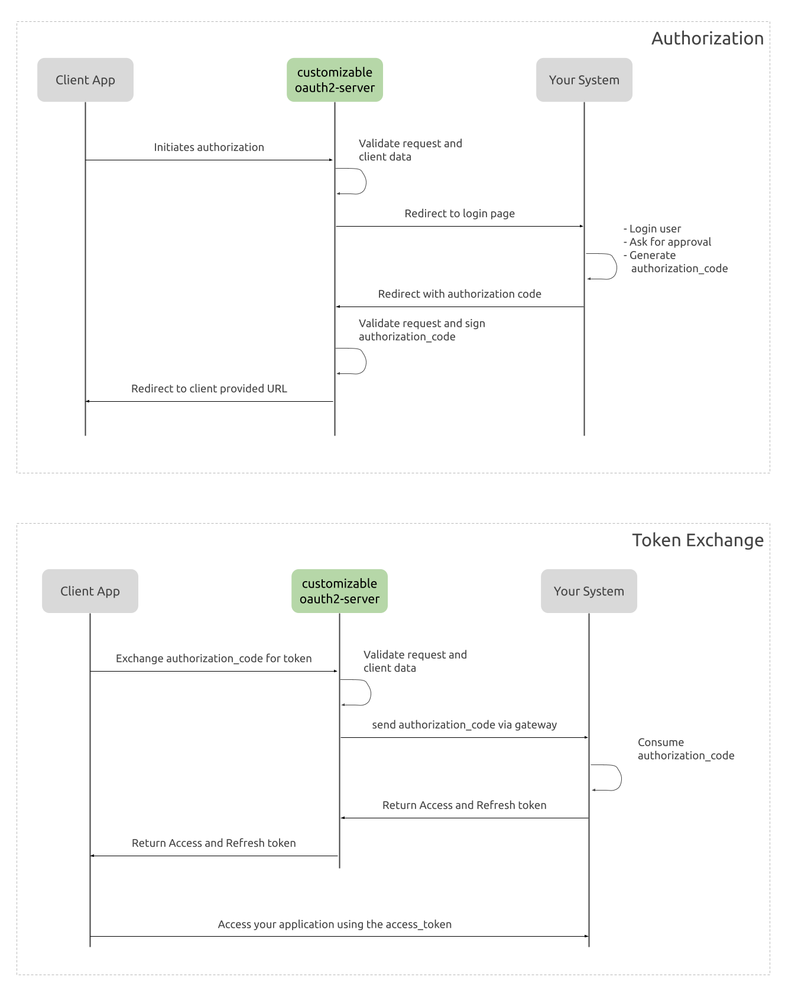

# Getting started

The goal of this project is to provide a scaffold for the ones who need to provide OAuth integration but already have their login systems in place.

Most famous web frameworks that provide some kind of user management have OAuth plugins available. However, most systems nowadays are sofisticated enough to implement their own usser session and management.

With this scenario in mind, this projects "wraps" your existing login systems with the OAuth2.0 framework. Almost everything is taken care of already (request and validation, context keeping between requests, response and errors) and you just need to adapt it to your reality and deploy to your infrastructure (See [Customizing](customizing.md)).

## Definitions you should know
### Login and Consent Page
The web page where the user will login and consent the authorization request.

### Authorization Code
Authorization code is a value that your systems need to be able to provide. This usually is a random value generated and cached to later be exchanged to an access and refresh token.

### Access and Refresh tokens
The access and refresh token (aka session tokens) used to access your application.

## Requests breakdown

## Disclaimer
This has not been peer reviewed. Make sure you are confortable with the security and architectural decisions before using it. I do not hold any responsibility for deployed versions.

